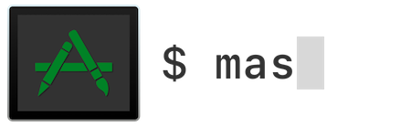

<h1 align="center">



</h1>

# mas

A command-line interface for the Mac App Store. Designed for scripting & automation.

[](https://github.com/mas-cli/mas/releases)
[](Package.swift)
[](LICENSE)
[](https://www.swift.org)
[](
    https://github.com/mas-cli/mas/actions/workflows/build-test.yaml?query=branch%3Amain
)
[](Package.swift)

## 📲 Installation

### 🔮 macOS 10.15 (Catalina) or newer

#### 🍺 Homebrew core formula

[Homebrew](https://brew.sh) is the preferred way to install:

```shell
brew install mas
```

#### 🔌 MacPorts

[MacPorts](https://www.macports.org/install.php) is an alternative way to install:

```shell
sudo port install mas
```

### 🧮 macOS 10.11 (El Capitan) - 10.14 (Mojave)

#### 🍻 Custom Homebrew tap

The [mas custom Homebrew tap](https://github.com/mas-cli/homebrew-tap) provides pre-built bottles for all macOS versions
since 10.11 (El Capitan). The newest versions of mas, however, are only available for macOS 10.15+ (Catalina or newer).

To install mas from the custom tap:

```shell
brew install mas-cli/tap/mas
```

#### 🐙 GitHub Releases

Alternatively, binaries & sources are available from [GitHub Releases](https://github.com/mas-cli/mas/releases).

#### 🕊 Swift 5 Runtime Support

mas requires Swift 5 runtime support. macOS 10.14.4 (Mojave) & newer include it, but earlier releases do not. Without
it, running mas might report errors similar to:

> dyld: Symbol not found: _$s11SubSequenceSlTl

To get Swift 5 support on macOS versions older than 10.14.4 (Mojave), you can:

- Update to macOS 10.14.4 (Mojave) or newer.
- Install the [Swift 5 Runtime Support for Command Line Tools](https://support.apple.com/en-us/106446).
- Install Xcode 10.2 or newer to `/Applications/Xcode.app`.

## 🤳 Usage

### 🪪 App IDs

Each application in the Mac App Store has an integer app identifier (app ID). mas commands accept app IDs as arguments &
output app IDs to uniquely identify apps.

`mas search` & `mas list` can be used to find the app IDs of relevant apps.

Alternatively, to find an app's app ID:

1. Find the app in the Mac App Store
2. Select `Share` > `Copy Link`
3. Extract the app ID from the URL.
   - e.g., extract app ID `497799835` from the URL for Xcode (<https://apps.apple.com/us/app/xcode/id497799835?mt=12>)

### 🛍 Info from the Mac App Store

None of the commands in this section require you to be logged into an Apple Account, neither for your macOS user nor in
the Mac App Store.

#### `mas search`

`mas search <search-term>` searches by name for applications available from the Mac App Store. Providing the `--price`
flag includes each app's price in the output.

```console
$ mas search Xcode
497799835 Xcode
688199928 Docs for Xcode
…
```

#### `mas lookup`

`mas lookup <app-id>` outputs more detailed information about an application available from the Mac App Store.

```console
$ mas lookup 497799835
Xcode 16.0 [Free]
By: Apple Inc.
Released: 2024-09-16
Minimum OS: 14.5
Size: 2.98 GB
From: https://apps.apple.com/us/app/xcode/id497799835?mt=12&uo=4
```

### 📚 Info from Your Local App Library

All the commands in this section require you to be logged into an Apple Account for your macOS user.

#### `mas list`

`mas list` outputs all the applications on your Mac that were installed from the Mac App Store.

```console
$ mas list
497799835 Xcode       (15.4)
640199958 Developer   (10.6.5)
899247664 TestFlight  (3.5.2)
```

#### `mas outdated`

`mas outdated` outputs all applications installed from the Mac App Store on your Mac that have pending updates.

```console
$ mas outdated
497799835 Xcode (15.4 -> 16.0)
640199958 Developer (10.6.5 -> 10.6.6)
```

Run [`mas update`](#mas-update) to install pending updates.

### ⬇️ Installing Apps

All the commands in this section require you to be logged into an Apple Account in the Mac App Store.

> Depending on your Apple Account settings, you might need to re-authenticate yourself in the Mac App Store to perform a
> get, install, lucky, or update, even if you are already signed in to an Apple Account in the Mac App Store.

#### `mas get`

`mas get <app-id>…` installs free applications that you haven't yet gotten/"purchased" from the Mac App Store.

> The `purchase` alias is currently a misnomer, because it currently can only "purchase" free apps. To purchase apps
> that cost money, please purchase them directly in the Mac App Store.

```console
$ mas get 497799835
==> Downloading Xcode
==> Installed Xcode
```

#### `mas install`

`mas install <app-id>…` installs apps that you have already gotten/"purchased" from the Mac App Store. Providing the
`--force` flag re-installs the app even if it is already installed on your Mac.

```console
$ mas install 497799835
==> Downloading Xcode
==> Installed Xcode
```

#### `mas lucky`

`mas lucky <search-term>` installs the first result that would be returned by `mas search <search-term>`. Like
`mas install`, `mas lucky` can only install apps that have previously been gotten/"purchased".

```console
$ mas lucky Xcode
==> Downloading Xcode
==> Installed Xcode
```

### 🆕 Upgrading Apps

All the commands in this section require you to be logged into an Apple Account in the Mac App Store.

> mas only installs/updates applications from the Mac App Store.
>
> Use [`softwareupdate(8)`](https://www.unix.com/man-page/osx/8/softwareupdate) to install system updates (e.g., Xcode
> Command Line Tools, Safari, etc.)

#### `mas update`

`mas update` updates outdated apps installed from the Mac App Store. Without any arguments, it updates all such apps.

```console
$ mas update
Upgrading 2 outdated applications:
Xcode (15.4) -> (16.0)
Developer (10.6.5) -> (10.6.6)
==> Downloading Xcode
==> Installed Xcode
==> Downloading Developer
==> Installed Developer
```

Updates can be performed selectively by providing app IDs to `mas update`.

```console
$ mas update 715768417
Upgrading 1 outdated application:
Xcode (15.4) -> (16.0)
==> Downloading Xcode
==> Installed Xcode
```

### Mac App Store Account Management

All the commands in this section interact with the Apple Account for which you are signed in to the Mac App Store. These
commands do not interact with the Apple Account for which your macOS user is signed in.

#### `mas signin`

> ⛔ The `signin` command is not supported on macOS 10.13 (High Sierra) or newer. On those macOS versions, please sign in
> via the Mac App Store instead. Please see [Known Issues](#known-issues).

On macOS 10.12 (Sierra) or older, `mas signin <apple-id>` signs in to the specified Apple Account in the Mac App Store.

```console
$ mas signin mas@example.com
Password:
```

Providing the `--dialog` flag signs in using a graphical dialog provided by Mac App Store.

```shell
mas signin --dialog mas@example.com
```

You can also embed your password in the command.

```shell
mas signin mas@example.com MyPassword
```

#### `mas signout`

`mas signout` signs out from the current Apple Account in the Mac App Store.

## 🍺 Homebrew integration

mas integrates with [homebrew-bundle]. If mas is installed, when you run `brew bundle dump`, your Mac App Store apps
will be included in the created Brewfile. See the [homebrew-bundle] docs for more details.

<!-- markdownlint-disable-next-line MD033 -->
## <a name="known-issues"></a> ⚠️ Known Issues

### 💥 Changed Apple Private Frameworks

mas uses multiple undocumented Apple private frameworks to implement much of its functionality. Over time, Apple has
silently changed these frameworks, breaking some functionality. Known issues include:

- ⛔ The `signin` command is not supported on macOS 10.13 (High Sierra) or newer.
  [#164](https://github.com/mas-cli/mas/issues/164)
- ⛔ The `account` command is not supported on macOS 12 (Monterey) or newer
  [#417](https://github.com/mas-cli/mas/issues/417)

### ⏳ Eventual Consistency

The Mac App Store operates on eventual consistency, so the versions seen by various parts of mas or the Mac App Store
might be inconsistent for short periods of time. This might cause symptoms like
[#384](https://github.com/mas-cli/mas/issues/384) & [#387](https://github.com/mas-cli/mas/issues/387).

### 📱 iOS & iPadOS Apps

Apple Silicon Macs can install & run iOS & iPadOS apps from the Mac App Store. mas does not yet support such apps.
[#321](https://github.com/mas-cli/mas/issues/321)

### 📺 Using `tmux`

mas operates via the same system services as the Mac App Store. These exist as separate processes with communication
through XPC. As a result of this, mas experiences similar problems as the pasteboard when running inside `tmux`. A
[wrapper tool exists](https://github.com/ChrisJohnsen/tmux-MacOSX-pasteboard) to fix pasteboard behavior which also
works for mas.

You should consider configuring `tmux` to use the wrapper, but, if you do not wish to do this, it can be used on a
one-off basis as follows:

```shell
brew install reattach-to-user-namespace
reattach-to-user-namespace mas install
```

### 📭 `mas list`, `mas outdated`, `mas uninstall`, or `mas update` does not detect installed apps

mas 2.0.0+ sources data for installed Mac App Store apps from macOS's Spotlight metadata store.

mas can only interact with installed Mac App Store apps if they have been indexed by the Spotlight Metadata Server (aka
MDS) background processes.

You can check if a Mac App Store app has been indexed in the metadata store by running:

```console
## General format:
$ mdls -rn kMDItemAppStoreAdamID /path/to/app
## Outputs nothing if the app is not indexed
## Outputs the app ID if the app is indexed

## Example:
$ mdls -rn kMDItemAppStoreAdamID /Applications/WhatsApp.app
310633997
```

If an app has been indexed in the metadata store, given its app ID, you can find the path to the app by running:

```console
$ mdfind 'kMDItemAppStoreAdamID == 310633997'
/Applications/WhatsApp.app
```

If any of your Mac App Store apps are not indexed, you can enable/rebuild the metadata store for all file system volumes
by running:

```shell
sudo mdutil -Eai on
```

## 🚫 When something doesn't work

If you see the following error, it's probably because you haven't yet gotten/"purchased" the app through the Mac App
Store. See [#46](https://github.com/mas-cli/mas/issues/46#issuecomment-248581233).

> This redownload is not available for this Apple Account either because it was bought by a different user or the item
> was refunded or canceled.

If mas doesn't work for you as expected (e.g., you can't install/update apps), run `mas reset`, then try again. If the
issue persists, please [file a bug](https://github.com/mas-cli/mas/issues/new). All feedback is much appreciated! ✨

## 🏗 Build from source

You can build from Xcode by opening the root mas directory, or from the terminal:

```shell
Scripts/build
```

Build output can be found in the `.build` directory within the project.

## 🧪 Tests

Tests are written using [Swift Testing](https://github.com/swiftlang/swift-testing).

```shell
Scripts/test
```

## 📄 License

Code is under the [MIT license](LICENSE).

mas was originally created by Andrew Naylor ([@argon on GitHub](https://github.com/argon) /
[@argon on X](https://x.com/argon)).

[homebrew-bundle]: https://github.com/Homebrew/homebrew-bundle
