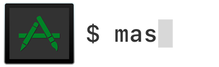

<h1 align="center">



</h1>

[](https://github.com/mas-cli/mas/releases)
[](Package.swift)
[](LICENSE)
[](https://www.swift.org)
[](
  https://github.com/mas-cli/mas/actions/workflows/build-test.yaml?query=branch%3Amain
)
[](Package.swift)

mas is a command-line interface for the Mac App Store that is designed for
scripting & automation.

## Table of Contents

- [Installation](#installation)
  - [macOS 13 (Ventura) or newer](#macos-13-ventura-or-newer)
  - [macOS 10.11 (El Capitan) - 12 (Monterey)](#macos-1011-el-capitan---12-monterey)
- [Usage](#usage)
  - [App IDs](#app-ids)
  - [Info from the App Store](#info-from-the-app-store)
  - [Info from your local app library](#info-from-your-local-app-library)
  - [Installing apps](#installing-apps)
  - [Upgrading apps](#upgrading-apps)
  - [App Store account management](#app-store-account-management)
  - [Root privileges](#root-privileges)
- [Integrations](#integrations)
- [Known Issues](#known-issues)
- [Troubleshooting](#troubleshooting)
- [Building](#building)
- [Testing](#testing)
- [License](#license)

## Installation

### macOS 13 (Ventura) or newer

#### Homebrew Core formula

[Homebrew](https://brew.sh) is the preferred way to install:

```shell
brew install mas
```

#### MacPorts

[MacPorts](https://www.macports.org/install.php) is an alternative way to
install:

```shell
sudo port install mas
```

### macOS 10.11 (El Capitan) - 12 (Monterey)

#### Homebrew tap

The [mas-cli Homebrew tap](https://github.com/mas-cli/homebrew-tap) provides
pre-built bottles for all macOS versions since 10.11 (El Capitan).

The newest versions of mas, however, are only available for macOS 13+ (Ventura
or newer).

To install mas from the tap:

```shell
brew install mas-cli/tap/mas
```

#### GitHub Releases

Alternatively, binaries & sources are available from
[GitHub Releases](https://github.com/mas-cli/mas/releases).

## Usage

### App IDs

Each app in the App Store has a unique integer app identifier (ADAM ID) & a
unique text app identifier (bundle ID). mas commands accept either form of app
ID as arguments.

`mas search` & `mas list` can be used to find the ADAM IDs of apps.

Alternatively, to find an app's ADAM ID:

1. Find the app in the App Store
2. Select `Share` > `Copy Link`
3. Extract the ADAM ID from the URL
   - e.g., extract ADAM ID `497799835` from the URL for Xcode
     (<https://apps.apple.com/us/app/xcode/id497799835?mt=12>)

### Info from the App Store

The commands in this section do not require you to be logged into an Apple
Account, neither for your macOS user nor for the App Store.

#### `mas search`

`mas search <search-term>` searches by name for apps available from the App
Store.

Providing the `--price` flag includes each app's price in the output.

```console
$ mas search Xcode
497799835 Xcode
688199928 Docs for Xcode
…
```

#### `mas lookup`

`mas lookup <app-id>` outputs more detailed information about an app available
from the App Store.

```console
$ mas lookup 497799835
Xcode 26.1.1 [Free]
By: Apple Inc.
Released: 2025-11-11
Minimum OS: 15.6
Size: 2,913.8 MB
From: https://apps.apple.com/us/app/xcode/id497799835?mt=12&uo=4
```

### Info from your local app library

All the commands in this section require you to be logged into an Apple Account
for your macOS user.

#### `mas list`

`mas list` outputs all the apps on your Mac that were installed from the App
Store.

```console
$ mas list
497799835 Xcode       (15.4)
640199958 Developer   (10.6.5)
899247664 TestFlight  (3.5.2)
```

#### `mas outdated`

`mas outdated` outputs all apps installed from the App Store on your Mac that
have pending updates.

```console
$ mas outdated
497799835 Xcode (15.4 -> 16.0)
640199958 Developer (10.6.5 -> 10.6.6)
```

Run [`mas update`](#mas-update) to install pending updates.

### Installing apps

All the commands in this section require you to be logged into an Apple Account
in the App Store.

> Depending on your Apple Account settings, you might need to re-authenticate in
> the App Store to perform a `get`, `install`, `lucky`, or `update`, even if you
> are already signed in to an Apple Account in the App Store.

#### `mas get`

`mas get <app-id>…` installs free apps that you haven't yet gotten/"purchased"
from the App Store.

[Requires root privileges to install apps](#root-privileges).

> The `purchase` alias is currently a misnomer, because it currently can only
> "purchase" free apps. To purchase apps that cost money, purchase them directly
> in the App Store.

```console
$ mas get 497799835
==> Downloading Xcode
==> Installed Xcode
```

#### `mas install`

`mas install <app-id>…` installs apps that you have already gotten or purchased
from the App Store. Providing the `--force` flag re-installs the app even if it
is already installed on your Mac.

[Requires root privileges to install apps](#root-privileges).

```console
$ mas install 497799835
==> Downloading Xcode
==> Installed Xcode
```

#### `mas lucky`

`mas lucky <search-term>` installs the first result that would be returned by
`mas search <search-term>`. Like `mas install`, `mas lucky` can only install
apps that have previously been gotten or purchased.

[Requires root privileges to install apps](#root-privileges).

```console
$ mas lucky Xcode
==> Downloading Xcode
==> Installed Xcode
```

### Upgrading apps

All the commands in this section require you to be logged into an Apple Account
in the App Store.

> mas only installs/updates apps from the App Store.
>
> Use [`softwareupdate(8)`](https://www.unix.com/man-page/osx/8/softwareupdate)
> to install system updates (e.g., Xcode Command Line Tools, Safari, etc.)

#### `mas update`

`mas update` updates outdated apps installed from the App Store. Without any
arguments, it updates all such apps.

[Requires root privileges to update apps](#root-privileges).

```console
$ mas update
Upgrading 2 outdated applications:
Xcode (15.4) -> (16.0)
Developer (10.6.5) -> (10.6.6)
==> Downloading Xcode
==> Installed Xcode
==> Downloading Developer
==> Installed Developer
```

Updates can be performed selectively by providing app IDs to `mas update`.

```console
$ mas update 715768417
Upgrading 1 outdated application:
Xcode (15.4) -> (16.0)
==> Downloading Xcode
==> Installed Xcode
```

### App Store account management

All the commands in this section interact with the Apple Account for which you
are signed in to the App Store. These commands do not interact with the Apple
Account for which your macOS user is signed in.

#### `mas signout`

`mas signout` signs out from the current Apple Account in the App Store.

### Root privileges

Root privileges are now necessary to install/update apps from the App Store,
because Apple secured `installd` on macOS 26.1+, 15.7.2+ & 14.8.2+ to fix
[CVE-2025-43411](https://nvd.nist.gov/vuln/detail/CVE-2025-43411). To simplify
the code, mas 4.0.0+ requires root privileges to install/update apps for all
versions of macOS, even older ones for which `installd` hasn't been secured.
Most users are already, or soon will be, using affected macOS versions.

Root privileges were always necessary to uninstall apps from the App Store,
because such apps are owned by the `root` user on macOS. mas 4.0.0+ will request
root privileges if you run mas without them, so you needn't remember to use
`sudo mas uninstall …` like beforehand.

Root privileges can be granted by running using `sudo mas …` on the command
line, or, if you run `mas` by itself without `sudo`, by entering your macOS
account password when prompted by `mas`. If you choose the latter route, the
supplied password is piped directly from the terminal to an external process
`sudo` call in the `mas` executable; your password is never seen by any mas
code, nor is it stored in any way.

Any sudo credentials used or established by the `mas` executable will remain
valid, pursuant to your user-configured sudo timeout settings.

## Integrations

### Homebrew Bundle

If mas is installed:

- `brew bundle dump` includes installed App Store apps in the generated
  `Brewfile`
- Homebrew Bundle commands will process App Store apps included in a `Brewfile`

See the
[Homebrew Bundle documentation](https://docs.brew.sh/Brew-Bundle-and-Brewfile)
for more details.

### Topgrade

If mas is installed, running [Topgrade](https://github.com/topgrade-rs/topgrade)
updates installed App Store apps.

## Known Issues

### Broken Apple private frameworks

mas uses multiple undocumented Apple private frameworks to implement much of its
functionality.

Over time, Apple has silently changed these frameworks, breaking some
functionality, including:

- [The `account` command is not supported on macOS 12 (Monterey) or newer](
    https://github.com/mas-cli/mas/issues/417
  )
- [The `signin` command is not supported on macOS 10.13 (High Sierra) or newer](
    https://github.com/mas-cli/mas/issues/164
  )

### Eventual consistency

The App Store operates on eventual consistency.

[The app versions seen by various parts of mas or the App Store might be
inconsistent for days](https://github.com/mas-cli/mas/issues/387).

### iOS & iPadOS apps

Apple Silicon Macs can install iOS & iPadOS apps from the App Store.

[mas does not yet support iOS or iPadOS apps](
  https://github.com/mas-cli/mas/issues/321
).

### `tmux`

mas depends on the same XPC system services as the App Store.

mas thus experiences similar problems as the pasteboard when running inside
`tmux`.

This [wrapper](https://github.com/ChrisJohnsen/tmux-MacOSX-pasteboard) allows
pasteboard & mas to work inside `tmux`.

`tmux` can be configured to always use the wrapper.

Alternatively, the wrapper can be used on a one-off basis:

```shell
brew install reattach-to-user-namespace
reattach-to-user-namespace mas install
```

### Undetected installed apps

mas 2.0.0+ sources data for installed App Store apps from macOS's Spotlight
Metadata Server (aka MDS).

You can check if an App Store app is properly indexed in Spotlight:

```console
## General format:
$ mdls -rn kMDItemAppStoreAdamID <path-to-app>
## Outputs the ADAM ID if the app is indexed
## Outputs nothing if the app is not indexed

## Example:
$ mdls -rn kMDItemAppStoreAdamID /Applications/WhatsApp.app
310633997
```

If an app has been indexed in Spotlight, the path to the app can be found:

```shell
mdfind 'kMDItemAppStoreAdamID = <adam-id>'
```

If any App Store apps are not properly indexed, you can reindex:

```shell
# Individual apps (if you know exactly what apps were incorrectly omitted):
mdimport /Applications/Example.app

# All apps (<LargeAppVolume> is the volume optionally selected for large apps):
mdimport /Applications /Volumes/<LargeAppVolume>/Applications

# All file system volumes (if neither aforementioned command solved the issue):
sudo mdutil -Eai on
```

## Troubleshooting

### Redownload not available

If the following error occurs, you probably [haven't yet gotten or purchased the
app from the App Store](#mas-install).

> This redownload is not available for this Apple Account either because it was
> bought by a different user or the item was refunded or canceled.

### Other issues

If mas doesn't work as expected (e.g., apps can't be installed/updated), run
`mas reset`, then try again.

If the issue persists, please [file a bug](
  https://github.com/mas-cli/mas/issues/new?template=01-bug-report.yaml
).

All feedback is much appreciated!

## Building

mas can be built in Xcode or built by the following script:

```shell
Scripts/build
```

Build output can be found in the `.build` folder in the project's root folder.

## Testing

Tests are implemented in
[Swift Testing](https://developer.apple.com/xcode/swift-testing).

Tests can be run by the following script:

```shell
Scripts/test
```

## License

Code is under the [MIT license](LICENSE).

mas was originally created by Andrew Naylor
([@argon on GitHub](https://github.com/argon) /
[@argon on X](https://x.com/argon)).
